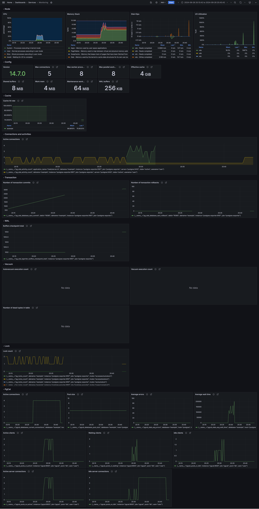

# postgresql-pgcat-example
This repository is for testing PostgreSQL and PgCat.

Metrics are collected by Prometheus and visualized with Grafana.

This repository is intended for testing the operation and performance of PostgreSQL and PgCat.

# Usage
| Command | Description |
| --- | --- |
| `make up` | Build and run containers. |
| `make down` | Stop and remove containers. |
| `open-srv` | Open services. |

# Monitoring
- Grafana: http://localhost:3001
	- User: admin
	- Password: password
- Prometheus: http://localhost:9090

## Description
This section explains each item that defined in my Grafana dashboard.

### Node
Metrics for monitoring the system resource consumption of PostgreSQL and PgCat.

These need to be monitored to ensure the stable operation and optimization of PostgreSQL and PgCat.

#### CPU
Metrics for monitoring CPU usage.

- System: CPU usage in kernel mode
- User: CPU usage by processes in user mode
- Nice: CPU usage by processes with adjusted priorities in user mode
- Iowait: CPU usage waiting for disk I/O
- Irq: CPU usage for handling hardware interrupts
- Sftirq: CPU usage for handling software interrupts
- Steal: CPU usage taken by the hypervisor in a virtual environment
- Idle: CPU time spent waiting while not doing any work

#### Memory Stack
Metrics for monitoring memory usage.

- Apps - Memory used by user-space applications: The amount of memory used by applications running in user mode
- PageTables: The amount of memory used by page tables (data structures that maintain the mapping between virtual and physical memory)
- SwapCache: The amount of memory used by swap cache (cache for data in the swap area on the disk)
- Slab: The amount of memory used by the slab cache (cache for managing memory efficiently by the OS)
- Cache: The amount of memory used by the cache (used to speed up data access between CPU and main memory)
- Buffers: The amount of memory used by buffers (temporary storage areas for data)
- Unused: The amount of physical memory not yet allocated by the OS
- Swap: The amount of memory used by swap (when physical memory runs out, inactive memory pages are moved to swap space on the disk)
- Hardware Corrupted: The amount of memory used when part of the physical memory is corrupted for any reason

#### Disk IOps
Metrics for monitoring the number of disk read/write operations.

This indicates the number of I/O operations per second.

#### I/O Utilization
Metrics for monitoring disk I/O utilization.

### Config
Shows various PostgreSQL configuration values.

#### Version
Indicates the version.

#### Max connections
Indicates the maximum number of connections.

If the database exceeds the maximum number of connections, further connections may be rejected.

To prevent resource exhaustion and connection waiting, it is necessary to set an appropriate maximum number of connections.

#### Max worker processes
Indicates the maximum number of worker processes.

If the database exceeds the maximum number of concurrent processes, performance may degrade.

#### Max parallel workers
Indicates the maximum number of workers for parallel query execution.

To prevent parallel queries from excessively consuming resources, it is necessary to set an appropriate maximum number of parallel workers.

#### Effective cache
Indicates the effective cache size used by the database.

To maximize the cache hit rate, it is necessary to set an appropriate cache size.

#### Shared buffers
Indicates the amount of data the database holds in shared buffers.

Setting an appropriate buffer size can reduce disk I/O and optimize database performance.

#### Work mem
Indicates the amount of memory used for temporary data processing.

Since this is used for query operations such as sorting and hash joins, setting an appropriate work memory size can optimize query memory usage and performance.

#### Maintenance work mem
Indicates the amount of memory used for maintenance tasks (e.g., VACUUM, CREATE INDEX).

It affects the efficiency of maintenance operations, so it is necessary to set an appropriate maintenance work memory size.

#### WAL buffers
Indicates the size of the WAL (Write-Ahead Logging) buffers.

WAL buffers are used for log writing and synchronization, so setting an appropriate WAL buffer size can optimize log writing performance and maintain transaction consistency.

### Cache
Metrics for monitoring database cache.

#### Cache hit rate
Indicates the percentage of data the database retrieves directly from the cache.

To reduce disk I/O and optimize database performance, it is necessary to maximize the cache hit rate.

### Connections and activities
Metrics for monitoring database connections and activities.

#### Active connections
Indicates the number of active clients connected to the database.

Excessive connections can lead to resource exhaustion and performance degradation, so it is necessary to set an appropriate number of connections.

### Transaction
Metrics for monitoring database transactions.

#### Number of transaction commits
Indicates the number of committed transactions.

This can be used as an indicator of the database's processing capacity and load, and to optimize performance.

#### Number of transaction rollbacks
Indicates the number of rolled-back transactions.

Frequent rollbacks may indicate problems with the application or data integrity, so monitoring is necessary.

### WAL
Metrics related to Write-Ahead Logging (WAL).

WAL is a mechanism for writing database transaction logs to ensure data durability and consistency.

WAL data is written to the WAL buffers in memory, and when committed or when the WAL buffers exceed the defined amount, it is written to the WAL files on disk.

#### Buffers checkpoint total
Indicates the total number of WAL checkpoints.

If this number is high, it means data is frequently being written to the disk, which can affect system performance, so monitoring is necessary.

A checkpoint is a specific point in time where all data files are updated to reflect the information in the logs.

### Vacuum
Metrics related to Vacuum.

#### Autovacuum execution count
Indicates the number of times autovacuum has been executed.

Autovacuum automatically runs VACUUM and ANALYZE.

VACUUM is used to reclaim free space in the database, and ANALYZE is used to update database statistics.

To monitor whether database maintenance is being performed correctly, it is necessary to check the autovacuum execution count.

#### Vacuum execution count
Indicates the number of times vacuum has been executed.

By monitoring the number of times manual or scheduled vacuum has been executed, you can check whether database maintenance is being performed correctly.

#### Number of dead tuples in table
Indicates the number of dead tuples in the table.

A tuple is a data structure representing a row in the database, and dead tuples refer to deleted rows.

If there are many dead tuples, database performance may degrade, so monitoring is necessary.

### Lock
Metrics for monitoring database locks.

#### Lock count
Indicates the number of locks that occurred in the database.

Monitoring the number of locks is necessary to track performance degradation and the risk of deadlocks.

### PgCat
Metrics related to PgCat.

#### Active connections
Indicates the number of active client connections to PgCat.

To monitor system load and performance, it is necessary to monitor the number of active connections.

#### Pool size
Indicates the maximum size of the connection pool PgCat reserves for the database.

By setting an appropriate pool size, you can optimize the number of connections to the database and improve performance.

#### Average errors
Indicates the average number of PgCat errors.

Since errors can affect system stability and availability, it is necessary to monitor the number of errors.

#### Average wait time
Indicates the average wait time in PgCat.

If wait times are long, system performance may degrade, so monitoring is necessary.

#### Active clients
Indicates the number of active clients in PgCat.

By monitoring the number of active clients, you can assess system load and performance.

#### Waiting clients
Indicates the number of clients waiting in PgCat.

If there are many waiting clients, system performance may degrade, so expanding pool size or optimizing query processing may be necessary.

#### Idle clients
Indicates the number of idle clients in PgCat. Idle clients are connected to the database but are not performing any operations.

If there are many idle clients, connection pool optimization and resource reuse may be required.

#### Active server connections
Indicates the number of active server connections PgCat has with the database.

By monitoring the number of active server connections, you can assess the number of connections and load on the database.

#### Idle server connections
Indicates the number of idle server connections PgCat has with the database.

If there are many idle server connections, connection pool optimization and resource reuse may be required.

# Load Testing
1. `http://localhost:8089`
2. Run load testing

If you want to scale the worker, run like this.
`docker compose up --scale worker=5`

If you run a load test with PostgreSQL or PgCat settings at extreme values, it will be easier to see trends in how changed parameters affect performance.

# References
- [PgCat configuration](https://postgresml.org/docs/open-source/pgcat/configuration)